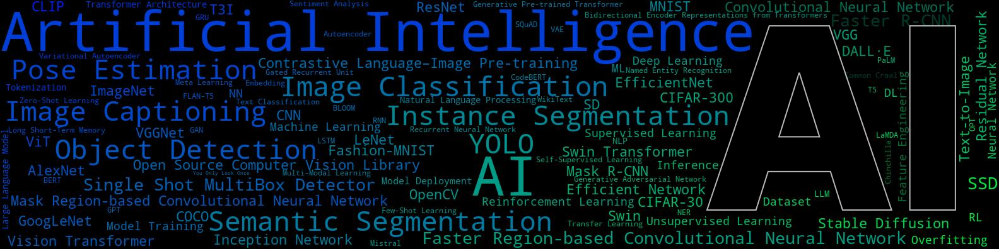

# LinkedIn banner generator

A tool to create customized LinkedIn banners (implementation of [worldcloud](https://github.com/amueller/word_cloud)).



## Installation

```sh
pip install -r requirements.txt
```

## Usage

To see all available options:

```sh
python main.py -h
```

## Creating a Mask

You can generate a mask in Figma using a default rectangle with dimensions 1584 x 396 pixels.

## Examples

See [examples.ipynb](examples.ipynb)

```sh
# Create a basic banner
python main.py "John Doe,Software Engineer"

# Custom styling
python main.py .\assets\texts\AI-commas.csv --mask .\assets\masks\AI-banner-colorized.jpg --color-mask --contour-width 1 --contour-color "#B9B9B9" --background-color black --min-font-size 1 --max-font-size 100
```

## Citations

If you find LinkedIn-banner-generator is useful, please consider giving us a star 🌟 and citing it.

```bibtex
@software{LinkedIn-banner-generator,
    author = {Colin de Seroux},
    month = apr,
    title = {LinkedIn-banner-generator},
    url = {https://github.com/colindeseroux/linkedin-banner-generator},
    version = {1.0.0},
    year = {2025}
}

@software{Mueller_Wordcloud_2023,
    author = {Mueller, Andreas C},
    month = apr,
    title = {{Wordcloud}},
    url = {https://github.com/amueller/wordcloud},
    version = {1.9.1},
    year = {2023}
}
```

## License

The wordcloud library is MIT licenced, but contains DroidSansMono.ttf, a true type font by Google, that is apache licensed. The font is by no means integral, and any other font can be used by setting the font_path variable when creating a WordCloud object.
